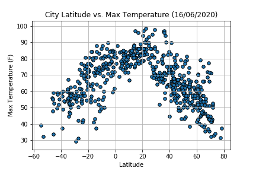
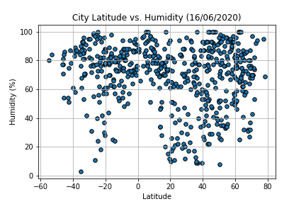
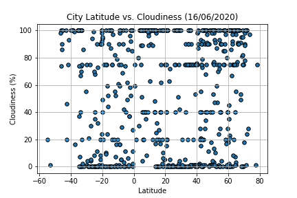
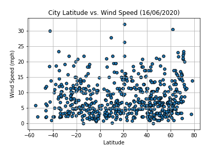
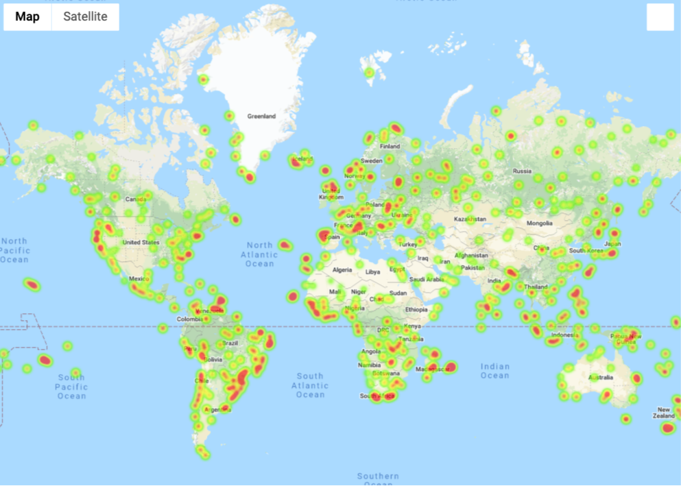

# What's the Weather Like?

## Challenge

Whether financial, political, or social -- data's true power lies in its ability to answer questions definitively. In this project, we try to answer a fundamental question: "What's the weather like as we approach the equator?"

Now, we know what you may be thinking: _"Duh. It gets hotter..."_

But, if pressed, how would you **prove** it?


## Steps

### Retrieve the data

* Latitude values are measured relative to the equator and range from -90° at the South Pole to +90° at the North Pole. Longitude values are measured relative to the prime meridian. They range from -180° when traveling west to 180° when traveling east.Please checkout [geographic coordinate system](http://desktop.arcgis.com/en/arcmap/10.3/guide-books/map-projections/about-geographic-coordinate-systems.htm) for further details.

* Generate a set of representation latitude and longitude values
  ``` python
  # Range of latitudes and longitudes
  lat_range = (-90, 90)
  lng_range = (-180, 180)

  #Create a seed
  np.random.seed(1000)

  # Create a set of random lat and lng combinations
  lats = np.random.uniform(lat_range[0], lat_range[1], size=1600)
  lngs = np.random.uniform(lng_range[0], lng_range[1], size=1600)
  ```
  
 * Find the closest city for each of the representational latitude and longitude values using python [citipy](https://pypi.python.org/pypi/citipy) library
 
    ``` python
    # Incorporate citipy to determine city based on latitude and longitude
    from citipy import citipy
    cities = []
    lat_lngs = zip(lats, lngs)

    # Identify nearest city for each lat, lng combination
    for lat_lng in lat_lngs:
        city = citipy.nearest_city(lat_lng[0], lat_lng[1]).city_name
        # If the city is unique, then add it to a our cities list
        if city not in cities:
            cities.append(city)
    ```
    Note:- Some latitude, longitude combination will not have nearest city (eg:- in the ocean). Hence, a larger set of lat,long   was kept initially to get more than 500 cities
 
 * Next, we perform weather check on each city in the list,  using a series of successive API calls to [OpenWeatherMap API](https://openweathermap.org/api) and extract ['City','Lat', 'Lng', 'Max Temp', 'Humidity', 'Cloudiness', 'Wind Speed', 'Country', 'Date']. This extracted data is kept in a DataFrame.
 
   ``` python
    #Create a placeholder DF for the extracted data from API calls
    weather_DF = pd.DataFrame(columns=['City','Lat', 'Lng', 'Max Temp', 'Humidity', 'Cloudiness', 'Wind Speed', 'Country', 'Date']) 

    #Data to get extracted
    summary = ['name', 'coord.lat', 'coord.lon', 'main.temp_max', 'main.humidity', 'clouds.all', 'wind.speed', 'sys.country', 'dt']             

    #Parms to pass to the API call
    params = {'units': 'imperial',
              'appid' : weather_api_key}

    #Iteratively call openweathermap api using python wrapper
    print("Beginning Data Retrieval\n\
    -----------------------------")
    count=0 #Successful queries
    for index, city in enumerate(cities):
        try:
            result = owm.get_current(city,**params)
            weather_DF.loc[count] = result(*summary)
            print(f"Processed Record {index} | {city}")
            count+=1
        except:
            print(f"Record {index}: City {city} not found. Skipping...") 
        time.sleep(1) #1 sec delay between API calls
    print("-----------------------------\n\
    Data Retrieval Complete\n\
    -----------------------------")         
   ```
### Visualization 

* Create a series of scatter plots to showcase the following relationships:

  * **Temperature (F) vs. Latitude**
  
    
  
  * **Humidity (%) vs. Latitude**
  
    
  
  * **Cloudiness (%) vs. Latitude**
  
    
  
  * **Wind Speed (mph) vs. Latitude**
  
    
  
  

* Run linear regression on each relationship, only this time separating them into Northern Hemisphere (greater than or equal to 0 degrees latitude) and Southern Hemisphere (less than 0 degrees latitude):

  * **Northern Hemisphere - Temperature (F) vs. Latitude**
  
  * **Southern Hemisphere - Temperature (F) vs. Latitude**
  
  * **Northern Hemisphere - Humidity (%) vs. Latitude**
  
  * **Southern Hemisphere - Humidity (%) vs. Latitude**
  
  * **Northern Hemisphere - Cloudiness (%) vs. Latitude**
  
  * **Southern Hemisphere - Cloudiness (%) vs. Latitude**
  
  * **Northern Hemisphere - Wind Speed (mph) vs. Latitude**
  
  * **Southern Hemisphere - Wind Speed (mph) vs. Latitude**

After each pair of plots explain what the linear regression is modeling such as any relationships you notice and any other analysis you may have.

**Optional** You will be creating multiple linear regression plots. To optimize your code, write a function that creates the linear regression plots.

Your final notebook must:

* Randomly select **at least** 500 unique (non-repeat) cities based on latitude and longitude.
* Perform a weather check on each of the cities using a series of successive API calls.
* Include a print log of each city as it's being processed with the city number and city name.
* Save a CSV of all retrieved data and a PNG image for each scatter plot.

### Part II - VacationPy

Now let's use your skills in working with weather data to plan future vacations. Use jupyter-gmaps and the Google Places API for this part of the assignment.

* **Note:** if you having trouble displaying the maps try running `jupyter nbextension enable --py gmaps` in your environment and retry.

* Create a heat map that displays the humidity for every city from the part I of the homework.

  

* Narrow down the DataFrame to find your ideal weather condition. For example:

  * A max temperature lower than 80 degrees but higher than 70.

  * Wind speed less than 10 mph.

  * Zero cloudiness.

  * Drop any rows that don't contain all three conditions. You want to be sure the weather is ideal.

  * **Note:** Feel free to adjust to your specifications but be sure to limit the number of rows returned by your API requests to a reasonable number.

* Using Google Places API to find the first hotel for each city located within 5000 meters of your coordinates.

* Plot the hotels on top of the humidity heatmap with each pin containing the **Hotel Name**, **City**, and **Country**.

  

As final considerations:

* Create a new GitHub repository for this project called `API-Challenge` (note the kebab-case). **Do not add to an existing repo**
* You must complete your analysis using a Jupyter notebook.
* You must use the Matplotlib or Pandas plotting libraries.
* For Part I, you must include a written description of three observable trends based on the data.
* You must use proper labeling of your plots, including aspects like: Plot Titles (with date of analysis) and Axes Labels.
* For max intensity in the heat map, try setting it to the highest humidity found in the data set.

## Hints and Considerations

* The city data you generate is based on random coordinates as well as different query times; as such, your outputs will not be an exact match to the provided starter notebook.

* You may want to start this assignment by refreshing yourself on the [geographic coordinate system](http://desktop.arcgis.com/en/arcmap/10.3/guide-books/map-projections/about-geographic-coordinate-systems.htm).

* Next, spend the requisite time necessary to study the OpenWeatherMap API. Based on your initial study, you should be able to answer  basic questions about the API: Where do you request the API key? Which Weather API in particular will you need? What URL endpoints does it expect? What JSON structure does it respond with? Before you write a line of code, you should be aiming to have a crystal clear understanding of your intended outcome.

* A starter code for Citipy has been provided. However, if you're craving an extra challenge, push yourself to learn how it works: [citipy Python library](https://pypi.python.org/pypi/citipy). Before you try to incorporate the library into your analysis, start by creating simple test cases outside your main script to confirm that you are using it correctly. Too often, when introduced to a new library, students get bogged down by the most minor of errors -- spending hours investigating their entire code -- when, in fact, a simple and focused test would have shown their basic utilization of the library was wrong from the start. Don't let this be you!

* Part of our expectation in this challenge is that you will use critical thinking skills to understand how and why we're recommending the tools we are. What is Citipy for? Why would you use it in conjunction with the OpenWeatherMap API? How would you do so?

* In building your script, pay attention to the cities you are using in your query pool. Are you getting coverage of the full gamut of latitudes and longitudes? Or are you simply choosing 500 cities concentrated in one region of the world? Even if you were a geographic genius, simply rattling 500 cities based on your human selection would create a biased dataset. Be thinking of how you should counter this. (Hint: Consider the full range of latitudes).

* Once you have computed the linear regression for one chart, the process will be similar for all others. As a bonus, try to create a function that will create these charts based on different parameters.

* Remember that each coordinate will trigger a separate call to the Google API. If you're creating your own criteria to plan your vacation, try to reduce the results in your DataFrame to 10 or fewer cities.

* Lastly, remember -- this is a challenging activity. Push yourself! If you complete this task, then you can safely say that you've gained a strong mastery of the core foundations of data analytics and it will only go better from here. Good luck!

### Copyright

Trilogy Education Services © 2019. All Rights Reserved.
