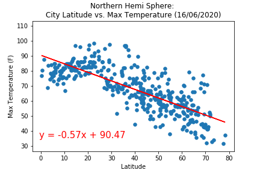
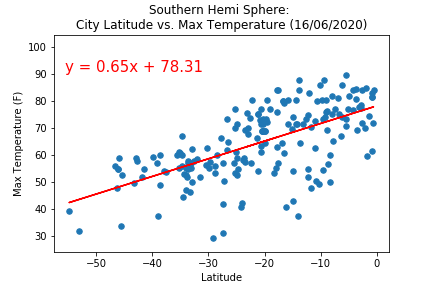
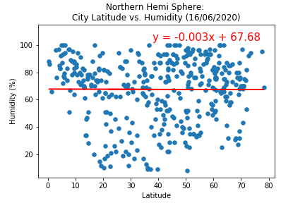
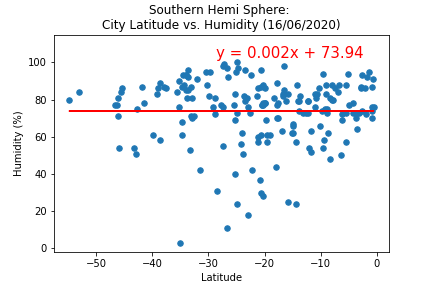
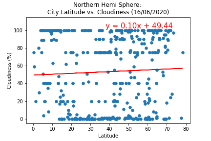
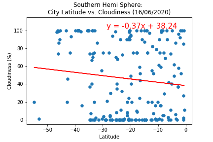
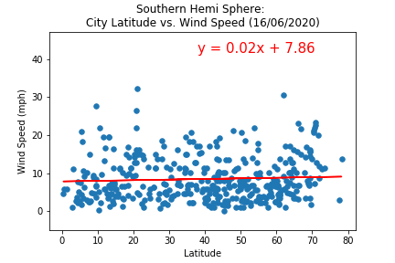
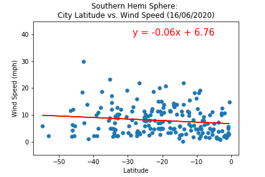
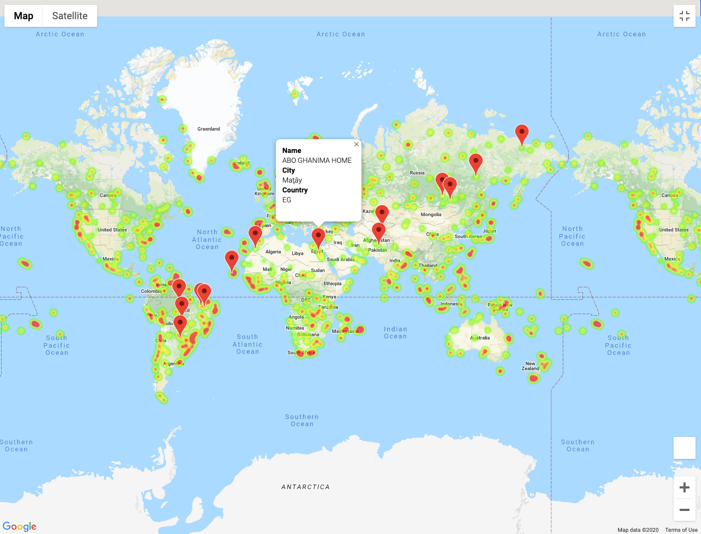

# What's the Weather Like?

## Challenge

Whether financial, political, or social -- data's true power lies in its ability to answer questions definitively. In this project, we try to answer a fundamental question: "What's the weather like as we approach the equator?"

Now, we know what you may be thinking: _"Duh. It gets hotter..."_

But, if pressed, how would you **prove** it?


## CodeBase

Please refer [WeatherPy.ipynb](CodeBase/WeatherPy.ipynb) and [VacationPy.ipynb](CodeBase/VacationPy.ipynb) for the detailed implementation.

## Steps

### Retrieve the data

* Latitude values are measured relative to the equator and range from -90° at the South Pole to +90° at the North Pole. Longitude values are measured relative to the prime meridian. They range from -180° when traveling west to 180° when traveling east.Please checkout [geographic coordinate system](http://desktop.arcgis.com/en/arcmap/10.3/guide-books/map-projections/about-geographic-coordinate-systems.htm) for further details.

* Generate a set of representation latitude and longitude values
  ``` python
  # Range of latitudes and longitudes
  lat_range = (-90, 90)
  lng_range = (-180, 180)

  #Create a seed
  np.random.seed(1000)

  # Create a set of random lat and lng combinations
  lats = np.random.uniform(lat_range[0], lat_range[1], size=1600)
  lngs = np.random.uniform(lng_range[0], lng_range[1], size=1600)
  ```
  
 * Find the closest city for each of the representational latitude and longitude values using python [citipy](https://pypi.python.org/pypi/citipy) library
 
    ``` python
    # Incorporate citipy to determine city based on latitude and longitude
    from citipy import citipy
    cities = []
    lat_lngs = zip(lats, lngs)

    # Identify nearest city for each lat, lng combination
    for lat_lng in lat_lngs:
        city = citipy.nearest_city(lat_lng[0], lat_lng[1]).city_name
        # If the city is unique, then add it to a our cities list
        if city not in cities:
            cities.append(city)
    ```
    Note:- Some latitude, longitude combination will not have nearest city (eg:- in the ocean). Hence, a larger set of lat,long   was kept initially to get more than 500 cities
 
 * Next, we perform weather check on each city in the list,  using a series of successive API calls to [OpenWeatherMap API](https://openweathermap.org/api) and extract ['City','Lat', 'Lng', 'Max Temp', 'Humidity', 'Cloudiness', 'Wind Speed', 'Country', 'Date']. This extracted data is kept in a DataFrame.
 
   ``` python
    #Create a placeholder DF for the extracted data from API calls
    weather_DF = pd.DataFrame(columns=['City','Lat', 'Lng', 'Max Temp', 'Humidity', 'Cloudiness', 'Wind Speed', 'Country', 'Date']) 

    #Data to get extracted
    summary = ['name', 'coord.lat', 'coord.lon', 'main.temp_max', 'main.humidity', 'clouds.all', 'wind.speed', 'sys.country', 'dt']             

    #Parms to pass to the API call
    params = {'units': 'imperial',
              'appid' : weather_api_key}

    #Iteratively call openweathermap api using python wrapper
    print("Beginning Data Retrieval\n\
    -----------------------------")
    count=0 #Successful queries
    for index, city in enumerate(cities):
        try:
            result = owm.get_current(city,**params)
            weather_DF.loc[count] = result(*summary)
            print(f"Processed Record {index} | {city}")
            count+=1
        except:
            print(f"Record {index}: City {city} not found. Skipping...") 
        time.sleep(1) #1 sec delay between API calls
    print("-----------------------------\n\
    Data Retrieval Complete\n\
    -----------------------------")         
   ```
### Visualization 

* Create a series of scatter plots to showcase the following relationships:

  * **Temperature (F) vs. Latitude**
  
    
  
  * **Humidity (%) vs. Latitude**
  
    
  
  * **Cloudiness (%) vs. Latitude**
  
    
  
  * **Wind Speed (mph) vs. Latitude**
  
    
  
 
### Regression Analysis
* Write a function that creates the linear regression plots

  ``` python
    def linregress_plots(DF, xl, yl, xlabel='Latitude', ylabel='', title='', figname='plot.png'):

    m, c, r, p, _ = linregress(DF[xl], DF[yl])
    print(f"The r-squared is: {r**2}")
    

    #Create a new figure
    _=plt.figure()

    #Scatter plot
    ax = DF.plot(x=xl, 
              y=yl,
              kind='scatter',
              s=30,
              title=title,
              ylim = (min(DF[yl])-5, max(DF[yl]+15))
              )            

    _=ax.set_xlabel(xlabel)
    _=ax.set_ylabel(ylabel)

    #Regression Line
    y=m*DF[xl] + c
    _=ax.plot(DF[xl], y, 'r-')
    
    
    pos=((0.15, 0.2) if m<=-0.4 else ((0.15, 0.75) if m>0.4 else (0.5, 0.80))) #Annotate position
    
    #A way to dynamically finds the number of decimal positions if there is avery small value Eg:- 0.000000067
    #We don't want to denote it as 0.00
    val = m*100
    digits = 2
    while int(val)==0:
        val*=10
        digits+=1
    
    s = "{:."+f"{digits}"+"f}"
    format_string = "y = "+s+"x + {:.2f}"
    linear_eqn = format_string.format(m, c)
    _=ax.annotate(linear_eqn,
            xy=pos, xycoords='figure fraction', fontsize=15, color='r')

    plt.savefig(f"../Images/{figname}")
    _=plt.show()
    
    return(r, p)

    #This function returns the r value, and p value
    #r value: Pearson Correlation Coefficient
    #p value: is a measure of the significance of the gradient. If p value is < 0.01 (Significance level),
    #it means that, we cannot independent variable affects dependant variable

  ```

* Run linear regression on each relationship, only this time separating them into Northern Hemisphere (greater than or equal to 0 degrees latitude) and Southern Hemisphere (less than 0 degrees latitude):

  * **Northern Hemisphere - Temperature (F) vs. Latitude**
  
    
  
  * **Southern Hemisphere - Temperature (F) vs. Latitude**
  
    
    
    ```diff
    
    + Temperature depends on the distance from equator. 
      * Please observe the p value of the linear regression estimator << 0. This means that slope is NOT zero
      * In both hemispheres, a high correlation between latitude and temperature
      * We can observe a pattern in scatter plot also
    + As we move towards equator, temperature increases in both sides of the hemisphere
    + From the data, it looks like, temperatures at cities equidistant from equator in both the sides might not be same.
        * For instance, 
            . At latitude +30, temperature is approximated as -0.57*30+90.47=73.37F
            . At latitude -30, temperature is approximated as 0.65*-30+78.31 = 58.81F. 
        * This is because, most of the northern hemisphere is land and most of the southern hemisphere is ocean and ocean is likely to be colder
    
    ```
  
  * **Northern Hemisphere - Humidity (%) vs. Latitude**
  
    
  
  * **Southern Hemisphere - Humidity (%) vs. Latitude**
  
    
    
    ```diff
    
    - Humidity(%) doesn't correlate with the distance from equator. 
      * Please observe that p value of the linear regression estimator >> 0 (>significance level(typically 0.05)). This means that WE CANNOT say that slope is NOT zero.
      * In both hemispheres, a near to ZERO correlation between latitude and humidity.
      * No pattern in scatter plot.
    - Humidity is centered around different values in both hemispheres.
        * In northern hemisphere, most of the cities are having humidity around 67%.
        * In southern hemisphere, most of the cities are having humidity around 73%.
    
    ```
    
  
  * **Northern Hemisphere - Cloudiness (%) vs. Latitude**
  
    
  
  * **Southern Hemisphere - Cloudiness (%) vs. Latitude**
  
    
    
    ```diff
    
    - Cloudiness(%) doesn't correlate with the distance from equator. 
      * Please observe that p value of the linear regression estimator > significance level (typically 0.05). This means that WE CANNOT say that slope is NOT zero.
      * In both hemispheres, a weak correlation between latitude and cloudiness.
      * No pattern in scatter plot.
    - Cloudiness is centered around different values in both hemispheres.
        * Northern hemisphere has average cloudiness around 53%.
        * Southern hemisphere has average cloudiness around 46%.
    
    ```
  
  * **Northern Hemisphere - Wind Speed (mph) vs. Latitude**
    
    
  
  * **Southern Hemisphere - Wind Speed (mph) vs. Latitude**
  
    
    
    ```diff
    
    - Windspeed doesn't correlate with the distance from equator. 
      * Please observe that p value of the linear regression estimator > significance level (typically 0.05).
          This means that WE CANNOT say that slope is NOT zero.
      * In both hemispheres, a weak correlation between latitude and Windspeed.
      * No pattern in scatter plot.
    - Windspeed is centered around different but close values in both hemispheres.
        * Northern hemisphere has average windspeed around 8.6 mph.
        * Southern hemisphere has average windspeed around 7.9 mph.
    
    ```

### Heatmap


* Create a heat map that displays the humidity for every city from the part I of the homework.
  
  
  

### Specify the ideal weather conditions

* Narrow down the DataFrame to find your ideal weather condition. For example:

  * A max temperature lower than 80 degrees but higher than 70.

  * Wind speed less than 10 mph.

  * Zero cloudiness.

  Drop any rows that don't contain all three conditions. You want to be sure the weather is ideal.

  ``` python
  
    DF_IDEAL = DF.drop(DF[~((DF['Max Temp']<80.0) & (DF['Max Temp']>70.0) & (DF['Wind Speed']<10.0) & (DF['Cloudiness']==0))].index)

    DF_IDEAL.info()
    
    <class 'pandas.core.frame.DataFrame'>
    Int64Index: 14 entries, 25 to 536
    Data columns (total 8 columns):
     #   Column      Non-Null Count  Dtype  
    ---  ------      --------------  -----  
     0   City        14 non-null     object 
     1   Country     14 non-null     object 
     2   Lat         14 non-null     float64
     3   Lng         14 non-null     float64
     4   Max Temp    14 non-null     float64
     5   Humidity    14 non-null     float64
     6   Cloudiness  14 non-null     float64
     7   Wind Speed  14 non-null     float64
    dtypes: float64(6), object(2)
    memory usage: 1008.0+ bytes
  
  ```
### Finds the most popular hotels in the identified cities

* Using Google Places API to find the first hotel for each city located within 5000 meters of your coordinates (The result is sorted based on popularity)

  ```python
  hotel_df = DF_IDEAL.iloc[:,:4].copy()
  hotel_df['Hotel Name'] = ""

  base_url = 'https://maps.googleapis.com/maps/api/place/textsearch/json'

  for index, row in hotel_df.iterrows():
      params = {
              "location": f"{row['Lat']},{row['Lng']}",
              "query": 'hotel',
              "radius": 5000,
              "key": g_key
              }
      try:
          result = requests.get(base_url, params).json()
          hotel_df.loc[index, "Hotel Name"] = result['results'][0]['name']

      except:
          print(f"Couldn't retrive hotel for {row['City']} at index {index}..Skipping")     
  
  ```

### Plot the hotels in Map
* Plot the hotels on top of the humidity heatmap with each pin containing the **Hotel Name**, **City**, and **Country**.
   
   
  
  
